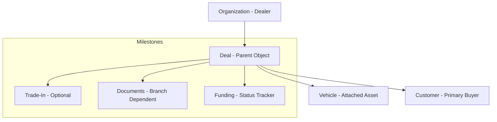

# Evo Motors Deals: End-to-End Architecture

## Current State Summary
The current Deal implementation in Evo Motors provides a foundational `Deal` model linked to a `User` (Customer) and a `Vehicle`. However, it functions as a linear, single-path state machine that is missing the branching logic required for real auto retail. 

**Key Limitations:**
- **Inflexible Flow**: Assumes a single sequence of events (Deposit -> Docs -> Contract -> Delivery).
- **No Branching**: Does not distinguish between Cash, Outside Financing, and Dealer-Arranged Financing.
- **Weak Inventory Link**: Vehicles are linked but not "locked" effectively, leading to potential double-deal risks.
- **Commercial Drift**: Pricing is often pulled live rather than being snapshotted at the start of the deal.
- **Missing Entry Points**: No "Start Deal" buttons from logical admin locations like Inventory Detail or Lead view.

## Target End-State
The target is a **Guided Transaction Workflow** (the "Deal Jacket") that acts as the source of truth for the vehicle purchase. It coordinates the dealer's internal workflow and the customer's external task list.

### Locked Canon (Core Invariants)
1. **Deal is the Parent**: The Deal object owns the transaction state, not the Vehicle or the Customer.
2. **Vehicle/Customer Attachment**: Vehicles and Customers are assets/parties attached to the Deal.
3. **One Active Deal Rule**: A vehicle can belong to at most one *active* (non-Cancelled, non-Completed) Deal at a time.
4. **Commercial Snapshot**: Sale price, fees, and terms must be snapshotted on the Deal record to prevent pricing drift if the inventory record is updated during negotiation.
5. **Branching Paths**: The system must branch logic (required docs, funding tasks) based on the selected Payment Path.
6. **Separate Deposits & Final Payment**: Deposits secure the reservation; Final Payment closes the transaction. They follow different tender rules and verification paths.
7. **Delivery Gate vs. Handoff**: `READY_FOR_DELIVERY` is a physical readiness state (Release Ready). A vehicle status remains `UNDER_CONTRACT` during this phase. The vehicle status transitions to **`SOLD`** only at the moment of actual physical handoff (`DELIVERED`). `COMPLETED` is the subsequent financial/admin finalization state.
8. **Draft vs. Committed Locking**: A `DRAFT` deal provides an internal soft-lock / warning only and does NOT remove the vehicle from public inventory. A committed state (e.g., `DEPOSIT_PENDING` or `DEPOSIT_RECEIVED`) triggers the hard/public reservation lock.
9. **Store-Configurable Tender Policies**: Dealers define which payment methods (Cash, Card, ACH, etc.) are allowed for each transaction phase.
10. **Document Governance**: E-signed and wet-signed contracts are treated as authoritative, immutable legal records with strict access control.
11. **Vehicle Swaps**: Operational reality allows swapping the asset mid-deal while maintaining the parent transaction and its history. (Phase 2).
12. **Minimal Phase 1A**: Phase 1A focuses on the guided creation and term snapshotting while reusing the existing deal detail page surfaces as much as possible.

## Parent/Child Relationships

### Why Deal is Parent
In auto finance, the contract is a "Retail Installment Sale Contract" between the dealer and buyer, which is then assigned to a lender. The Deal represents this contract and its prerequisites. The vehicle is simply the collateral being transferred.

## Pricing & Commercial Snapshot
Live inventory pricing is for marketing. Once a deal starts, the **Negotiated Price** must be locked.
- **Snapshot Fields**: `sellingPrice`, `dealerFees`, `governmentFees`, `taxesEstimate`.
- **Logic**: When a Deal is created, these values are initialized from the Vehicle's current price but thereafter live independently on the Deal.

## Payment Path Branching
The system must support three primary branches:
1. **Cash**: Simple transfer of funds. Milestone = Funds Verified.
2. **Outside Financing**: Buyer brings their own loan (Credit Union/Bank). Milestone = Lender Letter + Funding Received.
3. **Dealer-Arranged Financing**: Dealer submits to their network. Milestone = Credit App + Lender Approval + Stips Cleared.

## Phased Evolution Strategy
- **Phase 1A**: Guided creation flow + Price Snapshot + Basic Branch Selection. (Note: Phase 1 should prefer reuse of the existing `Deal.userId` relationship for the primary buyer. Avoid renaming this field during the first implementation pass unless the change is proven trivial and low-risk. Richer buyer-role normalization like `buyerId`, `coBuyerId`, or `DealCustomerRole` belongs to a later intentional schema evolution phase.)
- **Phase 1B**: Branch-aware checklist + Delivery Gate.
- **Phase 2**: Trade-in sub-flow + Co-buyer support + Customer Portal.

## What Not To Do
- **Do not** store the `dealId` on the `Vehicle` model as the primary link; keep the link on the `Deal`.
- **Do not** allow a Deal to complete without a verified customer ID and signed contract.
- **Do not** automatically update Deal pricing when Inventory pricing changes.
- **Do not** over-engineer Phase 1 with complex lender integrations.

## Open Questions
- Should "Draft" deals lock inventory immediately or only upon deposit? (Current recommendation: Draft = soft lock/warning; Deposit/Under Contract = hard lock).
- How do we handle "Backup Deals" if the primary deal is likely to fail? (Phase 2 consideration).
